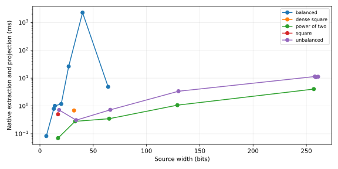

# Folded glut wiring, 2026-09-29

Production extraction now retains symbolic factor cells and exact interval intersections. Free cells represent unresolved assignments without expanding their concrete prefixes. Product bounds constrain the high rail; source bits and exact convolution carry constrain the low rail. Interval extrema preserve holes imposed by fixed cells.

Factor-width lanes advance fairly, each retaining a depth-first frontier. Propagation repeats when a cell gains information. This repairs two disconnected progress mechanisms: a wide lane could starve small-factor lanes, and endpoint rounding could iterate through a value’s magnitude without fixing a bit. No state, width, depth or decision quota is used.

For even sources, the low zero run closes through product valuation before prefix materialization. A selected pair is projected through actual convolution transitions. The returned checkpoints, complete product and re-entry certificate are independently replayed. Resumed explicit frames validate their ancestry, then reopen the authoritative source relation through the same folded path.

## Extraction measurements

All 21 composite fixtures close; the prime control returns an empty exact proper-pair relation. The same external 8 s observation window and 768 MiB address envelope were used as in the retained baseline. These are measurement process settings. Factor witnesses in the fixture metadata are used only for independent checks after extraction.

`Peak folds` counts live symbolic domains. `Peak cells` counts owned masks and interval bound tapes in those domains; it excludes temporary arithmetic storage and is not a process-memory measurement. Concrete prefix populations and symbolic domains are different units. Times include native extraction and verified checkpoint materialization, excluding compilation and certificate transport.

| Case | Source bits | Prior observation | Folded extraction ms | Peak folds | Peak cells |
|---|---:|---|---:|---:|---:|
| control_35 | 6 | closed | 0.083 | 3 | 57 |
| control_prime_127 | 7 | no proper pair | 0.158 | 4 | 96 |
| control_8051 | 13 | closed | 0.789 | 12 | 504 |
| balanced_14 | 14 | closed | 1.008 | 15 | 645 |
| square_17 | 17 | closed | 0.504 | 1 | 54 |
| balanced_20 | 20 | closed | 1.184 | 25 | 1563 |
| balanced_27 | 27 | closed | 26.461 | 78 | 6447 |
| dense_32 | 32 | closed | 0.689 | 1 | 99 |
| balanced_40 | 40 | interrupted | 2263.781 | 201 | 24477 |
| balanced_64 | 64 | interrupted | 4.878 | 91 | 17730 |
| sparse_17 | 17 | closed | 0.070 | 1 | 18 |
| sparse_33 | 33 | interrupted | 0.280 | 1 | 34 |
| sparse_65 | 65 | interrupted | 0.349 | 1 | 66 |
| sparse_129 | 129 | interrupted | 1.070 | 1 | 130 |
| sparse_257 | 257 | interrupted | 4.043 | 1 | 258 |
| unbalanced_18 | 18 | closed | 0.716 | 1 | 57 |
| unbalanced_34 | 34 | interrupted | 0.309 | 1 | 105 |
| unbalanced_66 | 66 | interrupted | 0.727 | 1 | 201 |
| unbalanced_130 | 130 | interrupted | 3.382 | 1 | 393 |
| unbalanced_258 | 258 | interrupted | 11.420 | 1 | 777 |
| unbalanced_5_259 | 259 | new fixture | 10.777 | 3 | 2340 |
| unbalanced_17_261 | 261 | new fixture | 11.234 | 17 | 13332 |



Raw measurements and static controls: [manifest](../membranes/glut_stress_2026-09-29_folded_verified/manifest.json). Earlier repair iterations are retained in the `folded`, `folded_v2`, `folded_final` and `folded_connected` run directories.

## Complete IMASM executable verification

`glut_one` bakes the source numeral. Its successful output consists of four IMASM words: source, p, q and the verified re-entry certificate. The complete executable carrier contains only the twelve marks, including code, operands, addresses, values, data and metadata.

The existing glyph-module codec transports lossless UTF-8 module records inside numeral payloads. Vox decodes the carrier into its lifted executable module before execution. Rust and static ELF remain retained build intermediates. The alphabet check and execution comparison establish the complete carrier and its value outputs; they do not establish a new glyph-native internal VM representation.

| Case | Source bits | Executed VM steps | IMASM execution s |
|---|---:|---:|---:|
| control_35 | 6 | 1171985 | 1.674 |
| balanced_64 | 64 | 59607026 | 54.633 |
| sparse_257 | 257 | 22190329 | 21.373 |
| unbalanced_258 | 258 | 66617723 | 60.332 |

Each retained glyph executable is alphabet checked, recovered byte-for-byte into its complete module, executed through Vox, and compared with its native control. The program’s output is independently alphabet checked. Artifact hashes, exit status and VM steps are in the [executable manifest](../membranes/glut_imasm_2026-09-29_verified/manifest.json).

## Verification and reproduction

- 255 library tests pass, including exhaustive four-cell interval/mask extrema and an independent proper-pair census for sources 0 through 1024.
- Four re-entry integration tests pass; all targets compile. Negative ancestry, carry, prefix and certificate tests remain active.
- Native stress results independently verify proper factors and exact integer products.

```sh
GLUT_STRESS_RUN=fresh_name python3 measurements/glut_stress_run.py
GLUT_IMASM_RUN=fresh_name python3 measurements/glut_imasm_bake.py
python3 measurements/glut_fold_report.py
```

Choose fresh names to preserve retained experiments. `GLUT_STRESS_CASES` and `GLUT_IMASM_CASES` select fixtures. The IMASM bake harness observes each Vox child for 120 s; this is external to the membrane.
