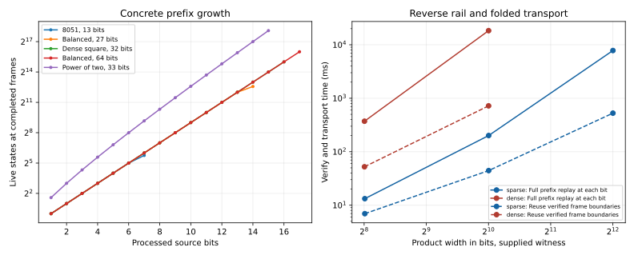

# Glut stress measurements

The baked extraction ladder measures the production glut on increasing source
width, word length, factor balance and bit density. Each executable contains
its source as a Vox-generated IMASM numeral. No runtime numeral is supplied.
The observer records the parity seed and each completed production frame.
Peak state counts in this report refer to completed frames; intra-frame
population and ancestry allocation can be larger.

Each process receives an external eight-second observation window and a
768 MiB address-space envelope. The extended measurements use thirty seconds
with the same envelope. These settings belong to the measurement process.
The glut retains its dynamic tapes and complete live set.

## Extraction ladder

Closed rows pass exact product verification, execution replay, trace replay,
certificate transport and the glut-specific certificate verifier. Each also
rejects an altered terminal carry. The prime control completes the source
without selecting a proper pair.

| Case | Bits | Ones | Numeral characters | Reading | Search ms / last frame ms | Peak frame states | Last position |
|---|---:|---:|---:|---|---:|---:|---:|
| control_35 | 6 | 3 | 34 | 5 × 7 | 0.445 | 4 | 3 |
| control_prime_127 | 7 | 7 | 39 | complete, no proper pair | 1.197 | 8 | 7 |
| control_8051 | 13 | 10 | 69 | 83 × 97 | 4.289 | 54 | 7 |
| balanced_14 | 14 | 6 | 74 | 101 × 103 | 2.474 | 60 | 7 |
| square_17 | 17 | 3 | 89 | 257 × 257 | 14.484 | 167 | 9 |
| balanced_20 | 20 | 11 | 104 | 1009 × 1013 | 31.027 | 512 | 10 |
| balanced_27 | 27 | 16 | 139 | 10007 × 10009 | 584.966 | 6,074 | 14 |
| dense_32 | 32 | 16 | 164 | 65535 × 65535 | 2401.253 | 32,768 | 16 |
| balanced_40 | 40 | 20 | 204 | external time stop | 4096.520 | 65,536 | 17 |
| balanced_64 | 64 | 33 | 324 | external time stop | 5644.517 | 65,536 | 17 |
| sparse_17 | 17 | 1 | 89 | 256 × 256 | 31.662 | 2,073 | 9 |
| sparse_33 | 33 | 1 | 169 | external time stop | 4518.762 | 278,528 | 15 |
| sparse_65 | 65 | 1 | 329 | external time stop | 3410.606 | 278,528 | 15 |
| sparse_129 | 129 | 1 | 649 | external time stop | 3602.724 | 278,528 | 15 |
| sparse_257 | 257 | 1 | 1289 | external time stop | 3915.511 | 278,528 | 15 |
| unbalanced_18 | 18 | 4 | 94 | 3 × 65537 | 49.636 | 254 | 17 |
| unbalanced_34 | 34 | 4 | 174 | external time stop | 4314.253 | 63,306 | 17 |
| unbalanced_66 | 66 | 4 | 334 | external time stop | 7196.801 | 65,536 | 17 |
| unbalanced_130 | 130 | 4 | 654 | external time stop | 5184.183 | 65,536 | 17 |
| unbalanced_258 | 258 | 4 | 1294 | external time stop | 4928.368 | 65,536 | 17 |

The 40-bit balanced case reaches position 19 and 262,144 live states in
22.26 seconds during its extended thirty-second reading. The 33-bit sparse
case reports an allocation failure under the external envelope after 13.11
seconds. Its last completed frame is position 15 with 278,528 states; the
sampled resident-memory peak is 706,392 KiB.

## Folding and reverse-rail connections

The sparse census hands the production sieve a 257-bit power of two and
advances it to position 14. All 131,072 survivors pass the reverse rail and
share zero carry. They span 120 pairs of leading-zero valuations and contain
3,801,088 stored value cells, excluding path ancestry and deduplication keys.
Both orientations are materialized: 65,472 states have their mirrored ordering.
The two all-zero prefix arms each contain 16,384 states. This identifies the
live representation to fold: the leading-zero product relation is expanded
into concrete prefixes while its shared carry remains unchanged.

Execution replay reuses the verified frame boundary. Every stored frame still
passes its full carry and product check. Between boundaries, advance checks each
source bit and reconstructs the precise factor prefixes, and the returned state
must equal the next checkpoint. Each intermediate prefix product is bounded
by that checked checkpoint because extending nonnegative prefixes cannot
decrease the product.

## Supplied-witness transport ladder

These readings build a path from separately baked, supplied factors. They
measure reverse replay and folded transport independently of extraction.
Checkpoint positions double with the source extent, and the final checkpoint
is exact product closure. All rows verify through certificate transport.

| Shape | Product bits | Construct path ms | Full prefix replay ms | Reused boundary replay ms | Trace records | Trace characters | Certificate characters |
|---|---:|---:|---:|---:|---:|---:|---:|
| sparse | 258 | 1.189 | 13.257 | 6.950 | 4 | 961 | 4241 |
| sparse | 1026 | 14.156 | 200.902 | 44.391 | 13 | 3448 | 46519 |
| sparse | 4098 | 133.789 | 7806.000 | 526.466 | 50 | 13299 | 662345 |
| dense | 257 | 10.952 | 372.001 | 52.300 | 4 | 986 | 4438 |
| dense | 1025 | 187.613 | 18372.409 | 720.824 | 13 | 3490 | 47610 |

## Lifted execution

The retained 35 failure control isolated a memory-push operand decoded at four
bytes in a 64-bit process. Its pushed trace pointer lost the high address bits.
The corrected decoder preserves the eight-byte operand for long-mode indirect
push, call and jump. A focused control pushes an address above 4 GiB and checks
the value on the guest stack.

The repaired lift of that same retained executable exits zero and agrees with
native execution on its input, frames, factor and certificate dimensions.
The separate mark-by-mark 35 trace control also agrees with native execution.
The retained 8051 stress executable exits zero after 20,440,457 VM steps.
The lifted 17-bit square reading reaches position 8 before its external
sixty-second observation window expires.

Current source checks pass all 251 library tests and all-target compilation.
The fresh connected 35 and 8051 membranes retain matching native and lifted
frame, factor, trace-length and certificate-length readings.



## Reproduction

```bash
python3 measurements/glut_stress_run.py
GLUT_STRESS_RUN=extended GLUT_STRESS_CASES=balanced_40,sparse_33 GLUT_STRESS_SECONDS=30 python3 measurements/glut_stress_run.py
GLUT_REPLAY_RUN=connected python3 measurements/glut_replay_stress_run.py
python3 measurements/glut_stress_plot.py
python3 measurements/glut_stress_report.py
```

Each directory retains the generated input, static executable, build output
and measured stdout/stderr. JSON manifests preserve per-case process settings,
exit codes, observed memory and completed frame frontiers. The executable files
preserve the paired replay implementations; rerunning the driver bakes the
current source. Use a fresh run name when comparing a further change.
